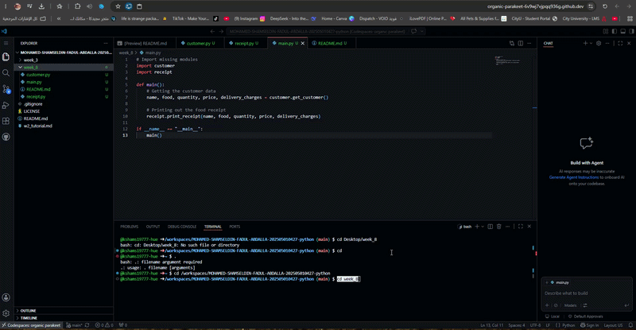

# Food Delivery System - Backend Receipt Generator

## Purpose of the Application
A backend Python component built for a Food Delivery System. It captures customer order inputs, computes the subtotal, adds a 5% service charge, and factors in dynamic delivery fees to generate a clean, formatted receipt.

## Tech Stack
* Python 3.x

## How to Use
1. Open the terminal and navigate to the `week_8` directory:

```bash
cd week_8
```

2. Run the main script:

```bash
python main.py
```

3. Enter the customer details when prompted.

---

## Application Demonstration
Below is the animated GIF demonstration showing the application running successfully:

