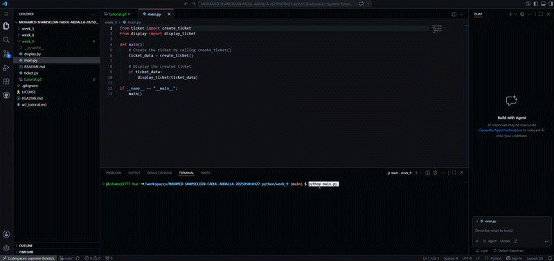

# Ticket Registration System - Week 9 Tutorial

## 1. Purpose of the Application
The IT Helpdesk Ticket Registration System is a modular Python application built for the IT Support team at City University Malaysia. The system allows students to submit technical support tickets for common university issues (such as LMS login problems, WiFi connectivity, printer issues, and password resets). It automatically processes the request, assigns an appropriate technician based on the issue's priority level, and sets the initial ticket status.

---

## 2. Tech Stack
* **Programming Language:** Python 3
* **Concepts Implemented:** Modular Programming, Functions, Conditional Statements, Dictionaries, User Input Handling
* **Version Control:** Git & GitHub

---

## 3. How to Use

### Prerequisites
Make sure you have Python 3 installed on your system.

### Steps to Run
1. Open your terminal or command prompt.
2. Navigate to the `week_9` directory:
   ```bash
   cd week_9

```

3. Run the main script:
```bash
python main.py

```


4. Enter the required details when prompted:
* **Student Name**
* **Student ID**
* **Issue Description**
* **Location**
* **Priority Level** (`High`, `Medium`, or `Low`)


---

## 4. Priority Assignment Rules

| Priority Level | Assigned Technician |
| --- | --- |
| **High** | Ahmad |
| **Medium** | Siti |
| **Low** | Ali |

---

## 5. Application Demo

Below is a screen recording demonstrating the execution of the application:



### Expected Console Output Sample:

```text
=== IT Helpdesk Ticket ===
Student Name : mohe
Student ID   : 12345678910
Issue        : blue screen pc
Location     : lab 101 level 1
Priority (High/Medium/Low): High

========== HELPDESK TICKET ==========
Student Name : mohe
Student ID   : 12345678910
Issue        : blue screen pc
Location     : lab 101 level 1
Priority     : High
Technician   : Ahmad
Status       : Pending
=======================================
